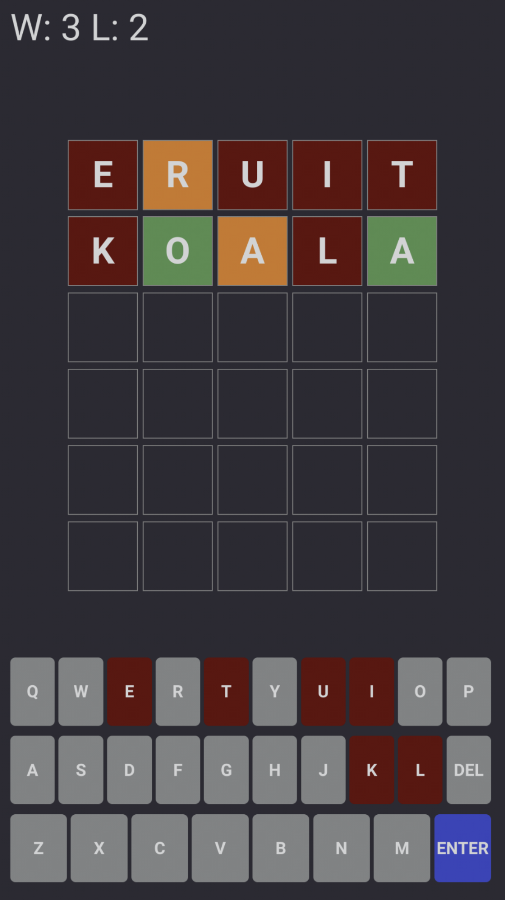

# Guess a word

Insipred by bulls and cows, Lingo and wordle.

The first version is in Dutch:

# Rules

Guess a 5 letter word. After entering a word you get a feedback for each letter:
- full match if letter is at the correct place
- partial match if letter is at the different place
- no match if letter does not exist

# Example

You can play the Dutch version of the game here: https://ifnull.org/wordnl/

**TODO**:
- implement dynamic loading
- add English
- add Russian
- add local storage for the current state (restore on page refresh)
