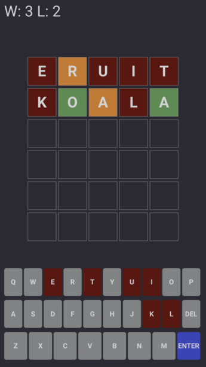

# Guess a word

Insipred by bulls and cows, Lingo and wordle.

Supports multiple languages. Where to play:
- [English](https://ifnull.org/wordnl/?lang=en)
- [Dutch (Nederlands)](https://ifnull.org/wordnl/?lang=nl)
- [Russian (Русский)](https://ifnull.org/wordnl/?lang=ru)
- [Tatar (Татарча)](https://ifnull.org/wordnl/?lang=tt)
- [Same version on GitHub pages](https://sharifmarat.github.io/lingo/?lang=en)

# Rules

Guess a 5 letter word. After entering a word you get a feedback for each letter:
- full match if letter is at the correct place
- partial match if letter is at the different place
- no match if letter does not exist

# Solver

There are two ways to trigger the solver:
- When the field is empty, click 3 times on `DEL`, followed by 3 clicks on `ENTER`.
- Or execute `solve()` in browser console.

Thanks to romst for the first implementation.

**TODO**:
- add local storage for the current state (restore on page refresh)
- rewrite in flutter/dart
